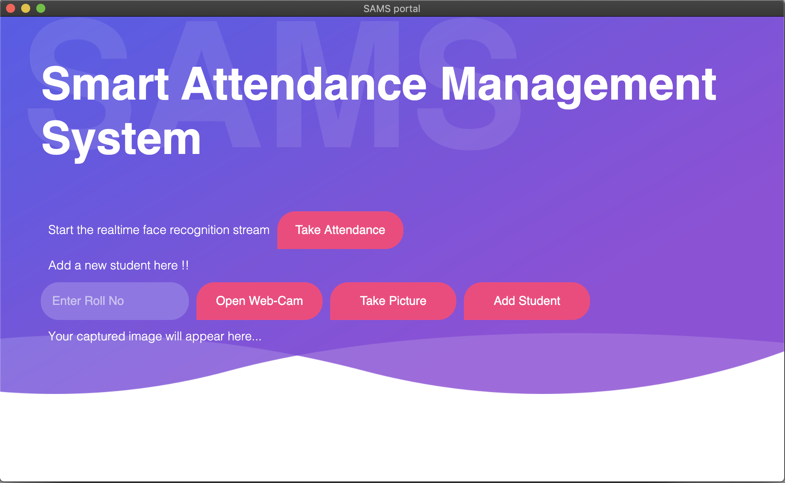

# SAMS

[](https://www.python.org/downloads/release/python-360/)

[](https://www.python.org/)
[](https://opencv.org)
[](https://github.com/saket13/SAMS/blob/master/LICENSE)
[](http://makeapullrequest.com)

A Desktop GUI for Smart Attendance Management System Using Realtime Face Recognition System


## Screenshots

**Adding New Student:**

**Take Attendance:**

| []  |  [] |
|:---:|:---:|
| TAKE ATTENDANCE | GUI |

| []  |  [] |
|:---:|:---:|
| ADD-1 | ADD-2 |

| []  |  [] |
|:---:|:---:|
| ADD-3 | ADD-4 |

## Design


This project has 2 modules:

First One, 'Add Student' module which adds a new student to the system. The image is taken through the WebCam. Image's Binary Data is sent from
             the GUI FrontEnd architecture through the local server
             to the BackEnd architecture which is responsible for saving the file in the ‘.jpeg’ format in the local directory (assets)
             where the application is residing. Then all the images are loaded one by one from the assets folder and then
             their 128-d face encodings are determined through the OpenCV library of Python.

Second One, 'Take Attendance' module is mainly responsible for fulfilling the objectives of the
            project i.e it receives the images from the webcam’s live server and then faces are detected using the
            different inbuilt algorithms of OpenCV and their 128-d encodings are then computed and the computed
            face encodings are then compared to the encodings stored in the Data Base which yields the student who-
            se face is obtained. And then the excel sheet is updated accordingly to the required Roll Number of the
            Identified Face.
            
Finally, both these modules have been merged together and and packages into an executable
            application using the Python’s Eel Library which is executable cross-platform i.e UNIX, LINUX and
            WINDOWS if the requirements are installed correctly and their paths are specified correctly. This final
            system can also be used in the web browsers.

## Installation

Clone the repo and install Rumps

```bash
git clone https://github.com/saket13/iBatteryStats 
sudo chmod +x path_to_iBatteryStats/iBatteryStats/battery.sh
sudo -H pip3 install rumps

```

Add this line to your cron tab (`crontab -e`):

     SHELL= /bin/bash   
     */1 * * * * /bin/bash/ path_to_iBatteryStats/iBatteryStats/battery.sh > path_to_iBatteryStats/iBatteryStats/back.log 2>&1
     # Here in crontab entry 1st argument says script is called every minute and second argument specifies where the script is and third where the log file is 

Modify your python script to fetch values:

```python
#Enter the absolute address of the file here and leave everything as it is
log_file_path = 'path_to_iBatteryStats/iBatteryStats/back.log'

```

## Usage

You can simply do:

```python
nohup python3 path_to_iBatteryStats/iBatteryStats/battery.py &

```
or to open the Application with no opening of terminal and on a single click

```bash
#Modify the content of app_shell to ::

#!/bin/sh
nohup python3 path_to_iBatteryStats/iBatteryStats/battery.py &

# And give it full permission ::

sudo chmod +x path_to_iBatteryStats/iBatteryStats/app_shell

```
## Future Ideas and TODOs

* Use `bokeh` to chart out the data?

* Handle every second stats and update it .
    * For now it is working every minute.

* Make this, the data dumping cron job and a battery status menu bar app indicator all a part of a single big application?

## Contributing
Pull requests are welcome. For major changes, please open an issue first to discuss what you would like to change.

Please make sure to update tests as appropriate.

## License

* MIT
