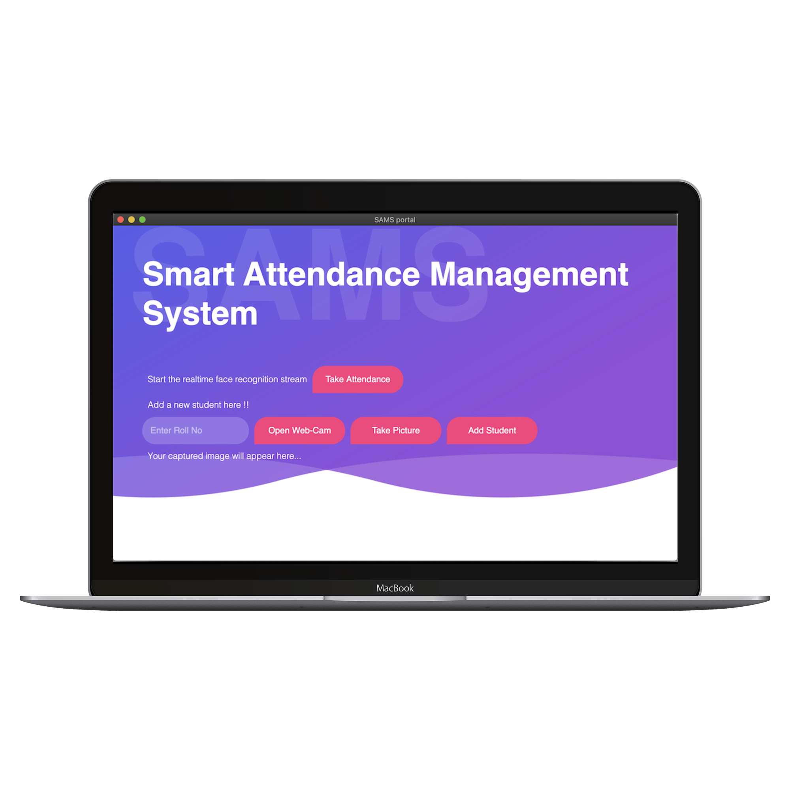
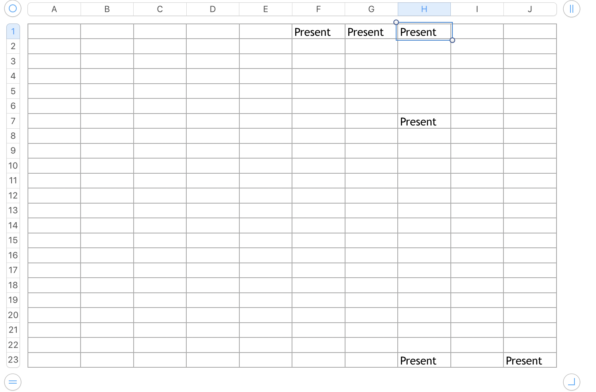

# SAMS

[](https://www.python.org/downloads/release/python-360/)

[](https://www.python.org/)
[](https://opencv.org)
[](https://github.com/saket13/SAMS/blob/master/LICENSE)
[](http://makeapullrequest.com)

A Desktop GUI for Smart Attendance Management System Using Realtime Face Recognition System


## Screenshots

**GUI:**

<p align="center">

</p>

**Adding New Student:**

|   |   |
|:---:|:---:|
| ADD-1 | ADD-2 |

|   |   |
|:---:|:---:|
| ADD-3 | ADD-4 |

**Updating Student's Attendance :**

|   |   |
|:---:|:---:|
| TAKE-ATTENDANCE | EXCEL SHEET |


## Design


This project has 2 modules:

First One, 'Add Student' module which adds a new student to the system. The image is taken through the WebCam. Image's Binary Data is sent from
             the GUI FrontEnd architecture through the local server
             to the BackEnd architecture which is responsible for saving the file in the ‘.jpeg’ format in the local directory (assets)
             where the application is residing. Then all the images are loaded one by one from the assets folder and then
             their 128-d face encodings are determined through the OpenCV library of Python.

Second One, 'Take Attendance' module is mainly responsible for fulfilling the objectives of the
            project i.e it receives the images from the webcam’s live server and then faces are detected using the
            different inbuilt algorithms of OpenCV and their 128-d encodings are then computed and the computed
            face encodings are then compared to the encodings stored in the Data Base which yields the student who-
            se face is obtained. And then the excel sheet is updated accordingly to the required Roll Number of the
            Identified Face.
            
Finally, both these modules have been merged together and and packages into an executable
            application using the Python’s Eel Library which is executable cross-platform i.e UNIX, LINUX and
            WINDOWS if the requirements are installed correctly and their paths are specified correctly. This final
            system can also be used in the web browsers.

## Package Structure
    
    SAMS App                  # Root Package (ZIP Format)
    .
    ├── Contains              
    │   ├── Assets            # Images of the new students a/c to roll no captured for training
    │   ├── Web               # All the front end files
    │   └── attendance.py     # Python code for establishing server and doing OpenCV work
    |   └── requirements.txt  # Requirements file
    |______________________   

## Installation

Clone the repo and install Requirements :

```bash
git clone https://github.com/saket13/SAMS
cd path_to_SAMS
pip3 install requirements.txt
```

Modify attendance.py File and put your Project File's path:

```bash
DIRECTORY_PATH = '/Users/saket/Downloads/SAMS/'                             # Put here the PROJECT DIRECTORY PATH
IMAGE_DIRECTORY_PATH = '/Users/saket/Downloads/SAMS/assets/'                # Put here the ASSESTS FOLDER PATH
```

## Usage

Run code in root mode(OpenCV requires it):

```python
python3 attendance.py (In Web Browser Mode)
```

After registering new students

```bash
Press CTRL + C to stop and 
run python3 attendance.py again to train new faces
```

For taking attendance 

```bash
Run code in root mode and
Click On 'Take Attendance' Button 
```

## Future Ideas and TODOs

* Deploy it on Cloud completely - AWS, Azure or GCP

* The images must be upright and single face only. Add Options for sideways too.

* Make a dashboard for admin

## Contributing
Pull requests are welcome. For major changes, please open an issue first to discuss what you would like to change.

Please make sure to update tests as appropriate.

## Contact
If you need any help, you can connect with me.

Visit:- [saketsaumya.info](https://saketsaumya.info)

## License

```
MIT License

Copyright (c) 2020 Saket Saumya

Permission is hereby granted, free of charge, to any person obtaining a copy
of this software and associated documentation files (the "Software"), to deal
in the Software without restriction, including without limitation the rights
to use, copy, modify, merge, publish, distribute, sublicense, and/or sell
copies of the Software, and to permit persons to whom the Software is
furnished to do so, subject to the following conditions:

The above copyright notice and this permission notice shall be included in all
copies or substantial portions of the Software.

THE SOFTWARE IS PROVIDED "AS IS", WITHOUT WARRANTY OF ANY KIND, EXPRESS OR
IMPLIED, INCLUDING BUT NOT LIMITED TO THE WARRANTIES OF MERCHANTABILITY,
FITNESS FOR A PARTICULAR PURPOSE AND NONINFRINGEMENT. IN NO EVENT SHALL THE
AUTHORS OR COPYRIGHT HOLDERS BE LIABLE FOR ANY CLAIM, DAMAGES OR OTHER
LIABILITY, WHETHER IN AN ACTION OF CONTRACT, TORT OR OTHERWISE, ARISING FROM,
OUT OF OR IN CONNECTION WITH THE SOFTWARE OR THE USE OR OTHER DEALINGS IN THE
SOFTWARE.
```
